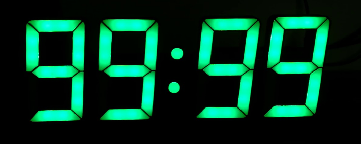

## Repaso del framework Scrum
El marco de trabajo Scrum, utilizado en el desarrollo ágil, estructura el trabajo en ciclos llamados "sprints", que suelen durar de una a cuatro semanas. Durante un sprint, hay varias reuniones claves:

Planificación del Sprint (Sprint Planning): Esta es la primera reunión del sprint. Aquí, el equipo de desarrollo, el scrum master y el dueño del producto (product owner) se reúnen para decidir qué trabajo se completará durante el próximo sprint. El dueño del producto presenta los elementos de la lista de pendientes (backlog) que considera más importantes, y el equipo de desarrollo determina cuánto de ese trabajo puede lograr durante el sprint.

Reunión Diaria de Scrum (Daily Scrum o Stand-Up Meeting): Esta es una reunión rápida de no más de 15 minutos que se realiza todos los días durante el sprint. Cada miembro del equipo de desarrollo informa sobre lo que hizo el día anterior, lo que planea hacer hoy y si tiene algún obstáculo. El objetivo es mantener a todos en el mismo canal y detectar rápidamente cualquier problema que pueda surgir.

Revisión del Sprint (Sprint Review): Al final del sprint, el equipo de desarrollo presenta su trabajo al dueño del producto y a los stakeholders. Esta es una oportunidad para recibir feedback sobre el trabajo realizado y para ajustar el backlog si es necesario.

Retrospectiva del Sprint (Sprint Retrospective): Esta es la última reunión del sprint. El equipo completo - el equipo de desarrollo, el scrum master y el dueño del producto - discuten qué fue bien durante el sprint, qué se podría mejorar y cómo implementar esos cambios en el próximo sprint. Esta es una oportunidad para que el equipo mejore continuamente su proceso.

# Sprint Planning
## Objetivo
El objetivo de esta reunión es decidir qué trabajo se completará durante el próximo sprint. El dueño del producto presenta los elementos de la lista de pendientes (backlog) que considera más importantes, y el equipo de desarrollo determina cuánto de ese trabajo puede lograr durante el sprint.

## Agenda
La reunión de planificación del sprint se divide en dos partes: la primera parte se centra en el qué, y la segunda parte en el cómo.

### Parte 1: Qué forma tendra el controladorMx

  

A partir de la reunion se determino un controlador multiproposito donde los usuarios podran conectar diferentes sensores y actuadores para realizar diferentes tareas, como por ejemplo:

* Control PWM (iluminacion,motores,calefaccion, generadores d/a), WS2812B, Display LCD - Oled
* Entradas Digitales(I2C, SPI, UART), Analogicas, 0-10 v, 0-20 ma, 4-20 ma.
* Salidas Digitales(I2C, SPI, UART), Analogicas, 0-10 v, 0-20 ma, 4-20 ma. 

### Parte 2: Cómo se hará el controladorMx

Se determino que el controladorMx se realizara con un microcontrolador ESP32, el cual cuenta con las siguientes caracteristicas:

* **CPU y Memoria**: Microprocesador Xtensa® Dual-Core 32-bit LX6 a 160/240 MHz (hasta 600 DMIPS), con coprocesador ULP y 520 KiB de SRAM.
* **Conectividad inalámbrica**: Wi-Fi 802.11 b/g/n, Bluetooth v4.2 BR/EDR y BLE, múltiples modos de Wi-Fi y protocolos de red, con fuertes características de seguridad y encriptación.
* **Interfaces periféricas**: Gran variedad, incluyendo ADC, DAC, sensores táctiles, interfaces SPI, I²S, I²C, UART, controladores SD y Ethernet MAC.
* **Seguridad**: Incluye todas las características de seguridad estándar IEEE 802.11, además de aceleración de hardware criptográfico (AES, SHA-2, RSA, ECC, RNG).
* **Gestión de energía**: Regulador interno de bajo dropout, dominio de energía individual para RTC, corriente de sueño profundo de 5uA.
* **Soporte para desarrollo**: SDK Firmware, cadenas de herramientas de código abierto basadas en GCC, soporte FreeRTOS y ESP-IDF, múltiples lenguajes de programación.
* **Otros**: Temperatura de funcionamiento de -40°C a 85°C, tamaño del paquete de 5 mm × 5 mm, 32 pines GPIO, certificado FCC/CE/TELEC.

Ademas se avanzara con el desarrollo de un visualizador de datos en tiempo real, el cual se implementara con los ws2812b. Se construira un panel tipo reloj 88:88 con 4 display de 10*15 cm cada uno, donde cada segmento sera de 3 ws2812b, dando un total de 21 led por display, 86 led en total (sumando los dos puntos del display).  
  

  

## Backlog del Proyecto ControladorMx (Revisado)
1. Especificaciones de Entrada

- Diseño y desarrollo de entradas digitales
- Diseño y desarrollo de escalado para sensores resistivos en tensión
- Diseño y desarrollo de entradas analógicas (canales) 0-10V, 0-20 mA y 4-20 mA
- Diseño y desarrollo de puertos de comunicación:
    - Entrada I2C
    - Entrada SPI
    - Entrada UART

2. Especificaciones de Salida

- Diseño y desarrollo de salidas digitales
- Diseño y desarrollo de salidas analógicas (canales) 0-10V, 0-20 mA y 4-20 mA
- Diseño y desarrollo de puertos de comunicación:
    - Salida I2C
    - Salida SPI
    - Salida UART
    - Salida PWM

3. Especificaciones de Display

- Diseño y desarrollo de control para display LCD 4x20
- Diseño y desarrollo de control para display gigante basado en WS2812B
    - Diseño de 4 displays de 7 segmentos con configuración de reloj 88:88, cada display mide 15x10 cm (alto-ancho)
    - Diseño del tablero de 21 cm de alto x 55 cm (+-2,5 cm) de largo
    - Incorporación de un conector para la comunicación WS2812B  

#
  
## Daily sprint Martes 16/05/2023
@everyone bitacora daily sprint Lunes 16/05/2023 
* Se define backlog sprint, desarrollo de especificaciones de display 
* No se puede seleccionar 3 Scrum Master por falta de concurrentes. 
* Se deja evidencia de la reunion: https://drive.google.com/file/d/1WqLXO37jCnXRTgFCulsGeOTb_m3SeAq0/view?usp=sharing

Nos vemos mañana en el daily, recuerden si quieren cambiar el horario me avisan. Saludos.  
  
  
#  
  
## Daily sprint Miercoles 17/05/2023  
@everyone Bitacora daily sprint Miercoles 17/05/2023 
* Se eligen 2 (dos) Scrum Master . Leonardo Gonzalez y Alfredo Palacios. 
* Se presentan Issues de la definicion de Displays
* Se asignan Issues de la definicion de Displays.
* Se deja evidencia de la reunion: https://drive.google.com/file/d/1W5Or1r0ycKB2vQC2P0FjzeOrhKedj9GD/view?usp=sharing

Nos vemos mañana en el daily, recuerden si quieren cambiar el horario me avisan. Saludos.  
 

